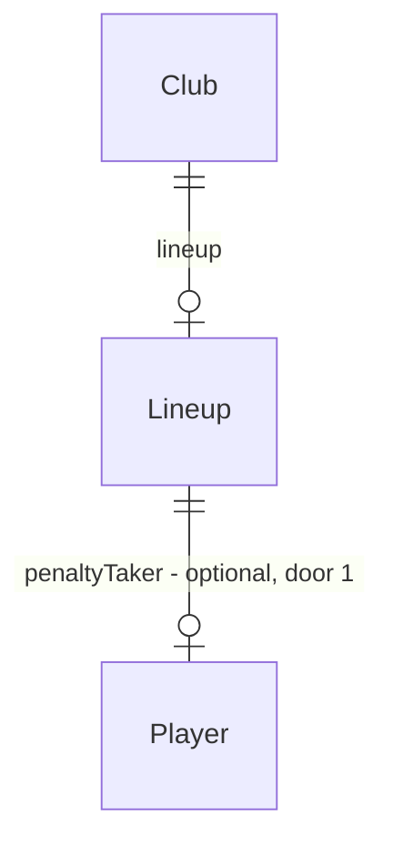

# Pênaltis durante o jogo e cobrador

## Problem

Dentro dos 90 minutos, uma partida só tem finalização de jogada: `stepMatch` (`src/engine/live.ts`) transforma uma chance em chute defendido, chute pra fora ou gol, e mais nada. Pênalti só existe na disputa depois de um empate em jogo de copa. Quem acompanha a partida ao vivo nunca vê «Pênalti para o …!», um dos lances mais marcantes do futebol e dos managers clássicos. E o usuário não decide quem bate: a disputa da copa escolhe os cobradores sozinha (atacantes primeiro, o mais forte antes), sem passar pela escalação.

A fonte não traz número sobre o problema; a feature está no Backlog do `STATE.md` (02/10/2026) e o autor escolheu esta como a próxima (03/10/2026).

Com esta feature:

- Parte das chances de ataque vira pênalti, cerca de 0,3 por jogo somando os dois times. A narração mostra a marcação e a cobrança (gol, defesa ou pra fora).
- Na tela Elenco, o usuário escolhe o cobrador entre os titulares, ou deixa «Automático».
- O cobrador escolhido bate os pênaltis do time durante o jogo e o primeiro da disputa da copa.
- A média de gols, o mando de campo e os cartões continuam nas faixas calibradas de hoje.

## Flow

Reusa o que já existe em vez de criar uma segunda versão:

- a chance de cobrança `penaltyChance` (exists) e a ordem automática `penaltyTakers` (exists) da disputa da copa;
- a força do goleiro `keeperStrength` (exists), que já cobre o gol sem goleiro;
- os eventos `goal` / `shot_saved` / `shot_missed`, com placar, artilharia, sons e contagens do balanço;
- o `editLineup` (exists) da store e o seletor do Elenco, ao lado de Formação, Postura e Treino.

1. Elenco: seletor «Pênaltis» -> `store.setPenaltyTaker` (new, beside `setPosture`) - grava `Lineup.penaltyTaker` do clube do usuário pelo `editLineup` (door 1); trocar formação ou postura mantém o campo
2. `startRound` / `startCupDate` -> `sideFor` (exists, `live.ts`) - copia `lineup.penaltyTaker` do usuário para `LiveSide.penaltyTaker` pelo `makeSide` (exists); a IA não tem cobrador
3. `penaltyTakers` (exists, `live.ts`) - a ordem automática de sempre, com o cobrador escolhido na frente quando está em campo
4. `stepMatch` (exists, `live.ts`) - depois de sortear a chance, um segundo sorteio decide se ela é pênalti; se for, grava o evento `penalty` e a cobrança do primeiro de `penaltyTakers`, contra `keeperStrength`, com `penaltyChance` (door 2)
5. `penaltyShootout` (exists, `live.ts`) - a disputa usa a mesma `penaltyTakers`, então o cobrador escolhido bate o primeiro
6. out: `narrate` (exists, `narration.ts`) e `effectsFor` (exists, `audio/sfx.ts`) leem os eventos novos; `decodeSaveFile` (exists, `saveFile.ts`) valida `penaltyTaker` na importação; `nextSeason` (exists, `rollover.ts`) mantém o cobrador na virada quando o clube é o mesmo

## Impact

| Front | What changes |
| --- | --- |
| domain | new term: `penaltyTaker` - o id do jogador que bate os pênaltis do usuário; ausente = Automático. Vive em `Lineup` (`engine/types.ts`) e em `LiveSide` (`live.ts`) |
| domain | new term: evento `penalty` - «pênalti marcado», sempre seguido no mesmo minuto da cobrança. Entra em `MATCH_EVENT_TYPES`, lido por `narration.ts`, `audio/sfx.ts` e pelos testes que enumeram os tipos (`live.test.ts`, `match.test.ts`, `narration.test.ts`) |
| domain | existing term: `goal` / `shot_saved` / `shot_missed` eram só lance de jogada; agora podem vir com `penalty: true`. Quem ramifica neles hoje: `narration.ts` (texto), `audio/sfx.ts` (som), `balance.test.ts` (conta finalizações) - placar, `Goal` e artilharia não mudam |
| domain | existing term: `penalty_scored` / `penalty_missed` continuam sendo só da disputa (`PENALTY_EVENT_TYPES`); `audio.ts` conta só esses para o jingle da disputa, então a cobrança no jogo não entra nessa conta |
| stored data | nothing to migrate: `Lineup.penaltyTaker` é opcional, ausente = Automático, save continua v8 (como AD-023); eventos vivem só na `LiveRound` em memória |
| balance | toda partida, inclusive as da IA (`simulateMatch`), passa a ter pênaltis; o sorteio extra muda o resultado de cada seed, e as faixas de `balance.test.ts` são a régua |

## Relations

One-way constraints: `penaltyTaker` ausente vale Automático (door 1). O id não precisa ser de titular nem do clube: fora de campo, vale a ordem automática. No more constraints.

## Surface

None - nothing consumed outside. O jogo roda no navegador, sem API; o arquivo exportado só ganha um campo opcional dentro da escalação, coberto pelo door 1.

## Landing

| One-way door | Literal shape | Alternative rejected |
| --- | --- | --- |
| 1. Cobrador no save | `Lineup.penaltyTaker?: string` (id do jogador; ausente = Automático), save v8 | `Club.penaltyTaker`: a escalação é onde já vivem as escolhas de partida (formação, postura) e é o que `sideFor` lê. `Player.isPenaltyTaker`: exigiria garantir um só por clube em toda venda, empréstimo e troca |
| 2. Pênalti nos eventos da partida | novo `MatchEventType` `"penalty"` (marcação) + `MatchEvent.penalty?: true` na cobrança, que é um `goal` / `shot_saved` / `shot_missed` comum | tipos novos de cobrança (`penalty_goal`…): cada leitor de `goal` (placar ao vivo, som, contagem do balanço) precisaria de um segundo caso. Reusar `penalty_scored` / `penalty_missed`: `audio.ts` contaria a cobrança do jogo como chute da disputa |

- Nothing else in this change is hard to reverse. A taxa de pênalti por chance e a divisão defesa/pra fora são constantes calibradas pelo balanço, como as de AD-007.

## Criteria

### S1: Pênalti dentro do jogo (P1)

Parte das chances vira pênalti, narrado e cobrado, em toda partida.

**Acceptance Criteria**

1. WHEN uma chance de ataque é criada em `stepMatch` THEN o motor SHALL fazê-la virar pênalti com a probabilidade fixa `PENALTY_PER_CHANCE`, gravando o evento `{ type: "penalty", clubId: <time atacante>, minute }` antes da cobrança.
2. WHEN um pênalti é marcado THEN o motor SHALL gravar, no mesmo minuto, exatamente um evento de cobrança do cobrador com `penalty: true`, e nenhum outro evento de finalização nesse minuto: `goal` (soma no placar e entra em `goals`), `shot_saved` ou `shot_missed`.
3. The motor SHALL fazer a cobrança virar gol com a probabilidade `penaltyChance(rating efetivo do cobrador na posição dele, keeperStrength do time que defende)`.
4. WHEN a cobrança não vira gol THEN o motor SHALL gravar `shot_saved` com a probabilidade fixa `PENALTY_SAVED_SHARE` e `shot_missed` no resto.
5. The motor SHALL, em 2000 partidas entre times iguais de rating 70, ter média de pênaltis por partida entre 0,2 e 0,4 e conversão entre 0,65 e 0,85.
6. The motor SHALL manter as faixas de `balance.test.ts` de hoje: média de gols 2,3–3,1 e vitória do mandante 0,40–0,52 entre iguais; forte contra fraco ≥ 0,75; postura; cartões; lesões; finanças.
7. The narração SHALL ser: `penalty` → «Pênalti para o {clube}!»; `goal` com pênalti → «GOL do {clube}! {jogador} cobra o pênalti e marca.»; `shot_saved` com pênalti → «{jogador} ({clube}) cobra o pênalti e o goleiro defende!»; `shot_missed` com pênalti → «{jogador} ({clube}) cobra o pênalti pra fora!».
8. The som SHALL ser `whistle-short` para `penalty`; a cobrança usa o som do tipo dela (gol: torcida e vinheta do usuário ou lamento; defesa e pra fora: «uh»).
9. IF o time que ataca não tem ninguém em campo THEN o motor SHALL não marcar pênalti nesse minuto.

**Independent test:** simular 2000 partidas iguais e contar `penalty` e as cobranças; jogar uma rodada ao vivo e ver a linha «Pênalti para o …!» seguida da cobrança.

### S2: Cobrador escolhido (P1)

O usuário escolhe quem bate, e isso vale no jogo e na disputa.

**Acceptance Criteria**

10. The tela Elenco SHALL mostrar o seletor «Pênaltis» depois de «Treino», com «Automático» e depois os titulares escalados, na ordem das vagas, cada um pelo nome.
11. WHILE `penaltyTaker` está ausente ou não é um titular escalado, o seletor SHALL mostrar «Automático».
12. WHEN o usuário escolhe um titular no seletor THEN a store SHALL gravar `lineup.penaltyTaker` com o id dele no save; WHEN escolhe «Automático» THEN SHALL remover o campo.
13. WHEN o usuário troca a formação ou a postura THEN a store SHALL manter `lineup.penaltyTaker`.
14. WHEN a temporada vira e o usuário continua no mesmo clube THEN `nextSeason` SHALL manter `lineup.penaltyTaker`.
15. WHILE o cobrador escolhido está em campo, o motor SHALL fazer dele o cobrador dos pênaltis do usuário no jogo.
16. IF o cobrador escolhido não está em campo (não escalado, substituído, expulso, lesionado, vendido) ou não há escolha THEN o motor SHALL usar o primeiro da ordem automática de hoje: atacante, meia, zagueiro, goleiro, o de maior rating efetivo antes dentro da posição.
17. WHEN a partida vai para a disputa de pênaltis e o cobrador escolhido está em campo THEN o motor SHALL fazê-lo bater o primeiro chute do time, e os outros seguem a ordem automática.
18. The motor SHALL usar a ordem automática para todo clube da IA.
19. WHEN um arquivo é importado THEN `decodeSaveFile` SHALL aceitar `lineup.penaltyTaker` ausente ou texto e SHALL recusar como `malformed` qualquer outro tipo.
20. The tela Elenco SHALL passar o `npm run check:layout` em 400 × 700 e em 1366 × 768 com o seletor novo.

**Independent test:** escolher um meia como cobrador, jogar até sair um pênalti a favor e ver o nome dele na cobrança; trocar a formação e ver o seletor manter o nome.

## Out of scope

| Excluded | Why |
| --- | --- |
| «(pên.)» ao lado do artilheiro nos resultados | `Goal` não muda; dá para fazer depois sem mexer no motor |
| Trocar o cobrador durante o jogo ao vivo | a tela de substituição não tem esse controle; a ordem automática cobre quem saiu |
| Parar a partida ao vivo no pênalti | a parada obrigatória (AD-022) é só para buraco no time |
| Cartão para quem comete o pênalti | mexeria na taxa de cartões calibrada |

## Assumptions

| Assumption | Chosen default | Rationale | Confirmed? |
| --- | --- | --- | --- |
| Valor inicial da taxa | `PENALTY_PER_CHANCE` começa em 0,025 e `PENALTY_SAVED_SHARE` em 0,6, ajustados pelo balanço dentro das faixas de AC 5 e AC 6 | ~6 chances por time por jogo × 0,025 ≈ 0,15 por time | n |
| Testes que fixam resultado de seed | o sorteio extra muda os resultados; um teste que fixa um placar ou um lance de seed recebe o valor novo, cada um listado no `## Handoff` do `checks.md`, sem afrouxar nenhuma faixa ou regra | precisão dos testes mantida; só o sorteio mudou | n |
| Quem pode ser escolhido | só titulares escalados aparecem no seletor | quem está no banco não bate pênalti nos 90 minutos | n |

**Open questions:** none - all resolved or logged above.

## Observable

| Surface | Decision | Landing |
| --- | --- | --- |
| screen Elenco, seletor «Pênaltis» | empty state | AC 11 (sem escolha, «Automático») |
| screen Elenco, seletor «Pênaltis» | loading state | n/a - o seletor lê o jogo que já está em memória |
| screen Elenco, seletor «Pênaltis» | error state | existing - falha ao gravar segue o `editLineup` dos outros seletores |
| screen Elenco, seletor «Pênaltis» | unauthorised state | n/a - jogo local, sem contas |
| screen Elenco, seletor «Pênaltis» | density and ordering | AC 10, AC 20 |
| screen Elenco, seletor «Pênaltis» | destructive action confirms | n/a - escolher cobrador não apaga nada e se desfaz no mesmo seletor |
| screen Ao vivo, narração | copy | AC 7 |
| screen Ao vivo, som | copy | AC 8 |

## Sources

- `.specs/STATE.md` `## Backlog`, linha «Pênaltis durante o jogo e cobrador», e o design aprovado pelo autor no chat em 03/10/2026
- AD-007 (simulação minuto a minuto) e a disputa de copa-nacional (`penaltyChance`, `penaltyTakers`)
